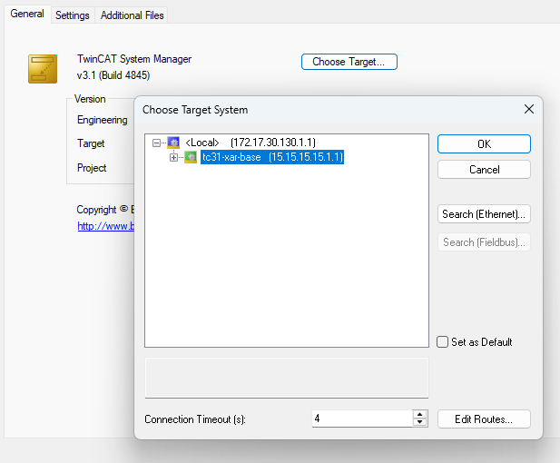

# About this Repository

This repository provides a step-by-step guide to build and deploy a containerized TwinCAT 3.1 XAR runtime environment using Docker on a Beckhoff IPC.

With this sample, you will learn how to:

- Build and configure a TwinCAT XAR container image.
- Set up direct ADS communication.
- Manage containers with Docker Compose and Makefile automation.
- Connect to the containerized TwinCAT runtime with TwinCAT Engineering.
- Configure real-time Ethernet communication (optional).

Here's a high-level overview of what the completed setup will look like:


---

## **How to get support**

Should you have any questions regarding the provided sample code, please contact your local Beckhoff support team. Contact information can be found on the official Beckhoff website at https://www.beckhoff.com/contact/.

---

## **Using the sample**

Before you begin, make sure your environment meets the following prerequisites:

**Beckhoff IPC as Beckhoff RT Linux host:**
- [Setup and Install](https://infosys.beckhoff.com/english.php?content=../content/1033/beckhoff_rt_linux/17350447499.html) the Beckhoff Real-Time Linux® Distribution on a supported IPC.
- [Configure access to Beckhoff package server](https://infosys.beckhoff.com/english.php?content=../content/1033/beckhoff_rt_linux/17350408843.html)
- Install the required host packages from the default Debian package sources:

```bash
sudo apt update
sudo apt install --yes docker.io docker-compose make tcsysconf
```

**Windows Engineering PC:**
- A separate Windows PC with [TwinCAT 3 Engineering (XAE)](https://www.beckhoff.com/en-us/products/automation/twincat/) installed to connect to and program the containerized runtime.
- Network connectivity between the Windows PC and the Beckhoff IPC running Beckhoff RT Linux.

**Beckhoff Account:**
- Valid [myBeckhoff](https://www.beckhoff.com/mybeckhoff/) credentials to access the Beckhoff package server at `https://deb.beckhoff.com`.

**Note:** This sample is designed for Beckhoff Industrial PCs running Beckhoff Real-Time Linux. While the Docker image may build on generic Debian systems, real-time functionality and hardware access require Beckhoff-supported hardware and the RT Linux distribution.

Unless a step explicitly says otherwise, run the Linux commands below on the Beckhoff IPC running Beckhoff RT Linux from the repository root directory.

Once the prerequisites are in place, you can follow these steps to build and deploy the TwinCAT XAR container:

## **1. Build the container image**

During the image build process, TwinCAT for Linux® will be downloaded from `https://deb.beckhoff.com`.

   a. Edit `./tc31-xar-base/apt-config/bhf.conf` and replace `<mybeckhoff-mail>` and `<mybeckhoff-password>` with your valid myBeckhoff credentials:

   ```bash
   nano ./tc31-xar-base/apt-config/bhf.conf
   ```

   Do not commit this file with real credentials.

   b. Build the Docker image. You can use the Makefile wrapper (recommended) or the direct docker command:

   **Option A: Using Makefile (from repository root)**
   ```bash
   sudo make build-image
   ```

   **Option B: Using docker directly**
   ```bash
   cd tc31-xar-base
   sudo docker build --secret id=apt,src=./apt-config/bhf.conf --network host -t tc31-xar-base .
   cd ..  # Return to repository root for subsequent steps
   ```

   c. Verify the image was built successfully:
   ```bash
   sudo docker images
   ```
   You should see an entry with repository `tc31-xar-base` and tag `latest` in the output.

## **2. Set up firewall rules for ADS**

On the **Beckhoff IPC running Beckhoff RT Linux that will run Docker**, allow incoming ADS traffic on ports `48898/tcp` and `48899/udp` so TwinCAT Engineering can reach the containerized runtime directly.

Create `/etc/nftables.conf.d/60-twincat-container.conf` with the following content:

```
sudo nano /etc/nftables.conf.d/60-twincat-container.conf
```

```nft
table inet filter {
  chain input {
    tcp dport 48898 accept
    udp dport 48899 accept
  }
  chain forward {
    type filter hook forward priority 0; policy drop;
    tcp sport 48898 accept
    tcp dport 48898 accept
    udp sport 48899 accept
    udp dport 48899 accept
  }
}
```

Save the file by pressing <kbd>Ctrl</kbd>+<kbd>o</kbd> and <kbd>Enter</kbd>.
Then close the editor via <kbd>Ctrl</kbd>+<kbd>x</kbd> and <kbd>Enter</kbd>.

Apply the rules by reloading the Beckhoff RT Linux nftables configuration, which already includes `/etc/nftables.conf.d/*`:

```bash
sudo systemctl reload nftables
```

Verify the rules were applied:

```bash
sudo nft list ruleset
```

You should see rules that reference ports `48898` and `48899` in the output, especially the `tcp dport 48898 accept` and `udp dport 48899 accept` rules and the corresponding forward-chain entries.

Because reloading nftables flushes the Docker-managed firewall rules, restart the Docker service afterwards so Docker can recreate its network rules before you start the sample containers:

```bash
sudo systemctl restart docker
```

## **3. Start the container**

The sample includes a `docker-compose.yaml` file to simplify the process of starting the TwinCAT runtime container and publishing its ADS ports on the host.

From the repository root directory, start the containers:

```bash
sudo docker compose up -d
```

Or using the Makefile:

```bash
sudo make run-containers
```

Verify the containers are running:

```bash
sudo docker compose ps
# Or: sudo make list-containers
```

You should see the `tc31-xar-base` container with status "Up". Check the logs if it is not running:

```bash
sudo docker compose logs
# Or: sudo make container-logs
```

If `sudo docker compose up -d` reports `pull access denied for tc31-xar-base`, go back to Step 1 and confirm that the local image `tc31-xar-base:latest` was built successfully. The Compose file expects that image to exist locally before the sample is started.

At this point, the Linux-host side of the sample is ready. The remaining direct ADS setup moves to the Windows engineering PC, except for the quick host-IP lookup in step 4(a).

## **4. Configure direct ADS connections**

To connect your TwinCAT Engineering system (running on Windows) directly with the containerized TwinCAT runtime:

   a. On your **Beckhoff IPC running Beckhoff RT Linux**, list the network interfaces and their IP addresses:
   ```bash
   ip --brief address
   ```
   In the output, look for the network interface that your Windows engineering PC can reach. Use its IPv4 address from the `inet` column when updating `ads-route.xml`. If the Beckhoff IPC has multiple network interfaces, choose the one that is connected to the same network as your Windows engineering PC.

   b. On your **Windows engineering PC**, edit the `ads-route.xml` template from this repository. Replace `ip-address-of-container-host` with the IP address from step (a) - this is the IP address of your Beckhoff IPC running Beckhoff RT Linux and Docker.

   c. Copy the edited `ads-route.xml` file to the TwinCAT routes directory, renaming it to `StaticRoutes.xml`:
   ```
   C:\Program Files (x86)\Beckhoff\TwinCAT\3.1\Target\Routes\StaticRoutes.xml
   ```

   If `StaticRoutes.xml` already contains routes you need, merge the `<Route>` entry into its existing `<RemoteConnections>` element instead of replacing the file. Restart the TwinCAT system service or reopen the TwinCAT configuration so the route is loaded.

   d. Restart the **TwinCAT System Service on Windows** (right-click the TwinCAT icon in the system tray → Config).

   e. The containerized TwinCAT runtime should appear as an available target system in TwinCAT Engineering. In the default sample configuration, look for the target that uses AMS Net ID `15.15.15.15.1.1`.



**Troubleshooting:** If the target does not appear:
- Verify the Beckhoff IPC running Beckhoff RT Linux is reachable from the Windows engineering PC
- Verify the containers are running: `sudo docker compose ps` on the Beckhoff IPC running Beckhoff RT Linux
- Check container logs: `sudo docker compose logs`
- Verify that TCP port `48898` and UDP port `48899` are allowed through the Beckhoff IPC firewall

## **5. Configure real-time Ethernet (Optional)**

**Note:** This step is only required if you plan to use EtherCAT or other real-time Ethernet protocols with TwinCAT.

Real-time Ethernet communication requires the `vfio-pci` driver for a PCI-based network device. Use the command line tool `TcRteInstall` to assign the `vfio-pci` driver to network devices of the IPC.

**Warning:** A network device bound to `vfio-pci` will no longer be available for standard Linux networking. Do not bind your primary network interface if you rely on it for remote access.

1. List available network devices for real-time Ethernet communication:

   ```bash
   sudo TcRteInstall -l
   ```

2. Assign the `vfio-pci` driver by passing the PCI device `Location` of the network interface you want to dedicate to TwinCAT:

   ```bash
   sudo TcRteInstall -b <PCI device Location>
   ```

   For example: `sudo TcRteInstall -b 0000:02:00.0`

   Choose a device that is not being used for your primary network connection to avoid losing connectivity to the host.

3. Verify the assignment:

   ```bash
   sudo TcRteInstall -l
   ```

   The output should now show `vfio-pci` in the `Driver` column for the device you configured.

4. For TwinCAT to detect the new configuration, restart the TwinCAT runtime container:

   ```bash
   sudo make restart-containers
   ```

   Or using docker compose directly:

   ```bash
   sudo docker compose restart tc31-xar-base
   ```

**Advanced:** By default, the container will probe all available PCI network devices bound to `vfio-pci`. You can control this behavior by setting the `PCI_DEVICES` environment variable in `docker-compose.yaml`. See the comments above the `environment:` section in that file for details on setting `PCI_DEVICES` to `NONE` or an explicit list of PCI addresses.

---

## Additional Commands

This repository includes a `Makefile` with shortcuts for common Docker operations. Run `make help` to see all available targets:

```bash
make help
```

Available targets:
- `build-image` — Build the TwinCAT container image
- `push-image` — Push the TwinCAT container image to a registry
- `run-containers` — Start containers using Docker Compose
- `restart-containers` — Restart containers
- `list-containers` — List all containers managed by Docker Compose
- `stop-and-remove-containers` — Stop and remove containers
- `container-logs` — Show logs for all containers

Example:
```bash
sudo make build-image
sudo make run-containers
sudo make container-logs
```
